# biggan-512 图片素材

由神经网络 biggan-512 生成的图片

* 模型来源：[https://tfhub.dev/deepmind/biggan-512/2](https://tfhub.dev/deepmind/biggan-512/2)
* 使用 tensorflow 2.3 运行
* 共 1000 类，每类生成 100 张图片，以 jpg 格式储存

网页版：[https://playmat365.github.io/biggan_512/](https://playmat365.github.io/biggan_512/)

# 预览

点击图片可查看该分类

[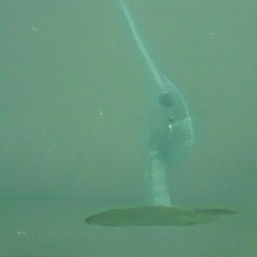](pics/0_鱼_tench) [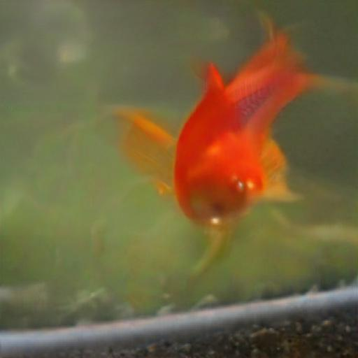](pics/1_鱼_goldfish)  [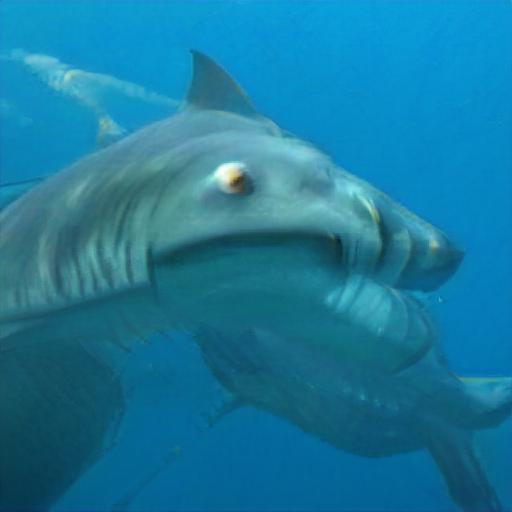](pics/3_鱼_tiger_shark) [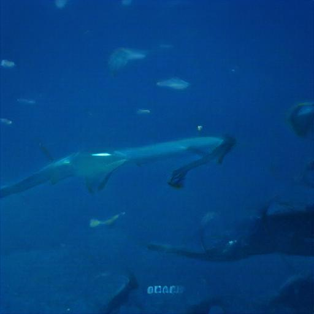](pics/4_鱼_hammerhead) [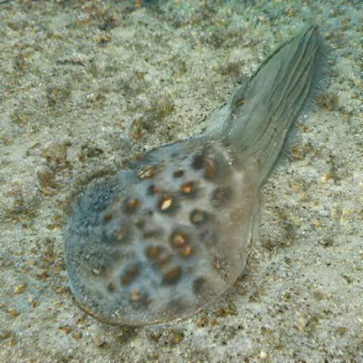](pics/5_鱼_electric_ray)  [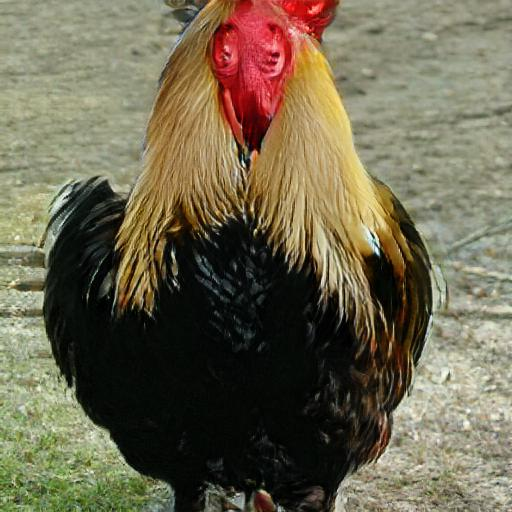](pics/7_鸡_cock) [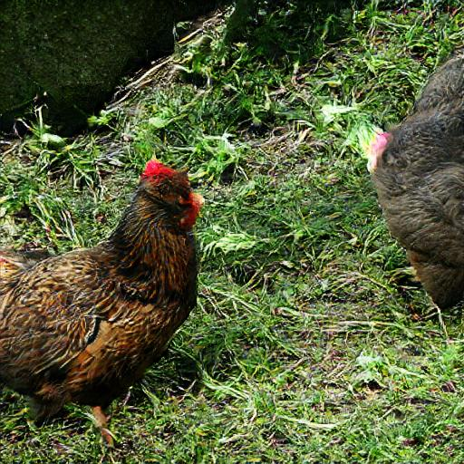](pics/8_鸡_hen) [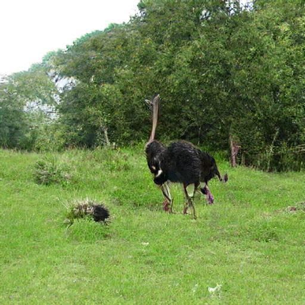](pics/9_鸵鸟_ostrich) [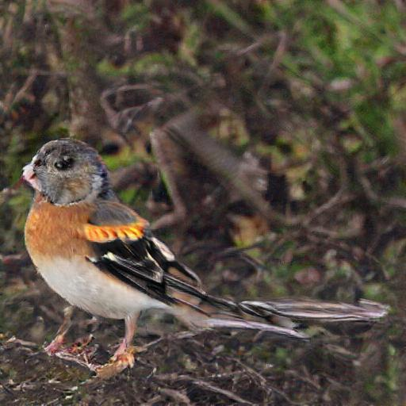](pics/10_鸟_brambling) [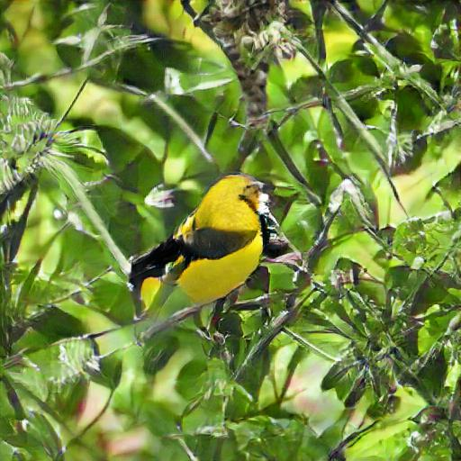](pics/11_鸟_goldfinch) [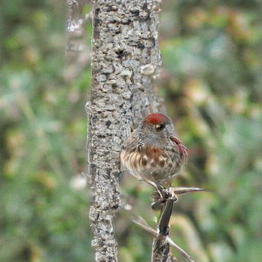](pics/12_鸟_house_finch) [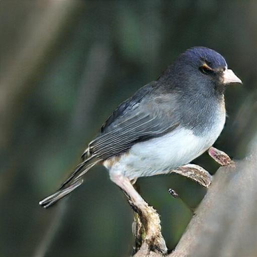](pics/13_鸟_junco) [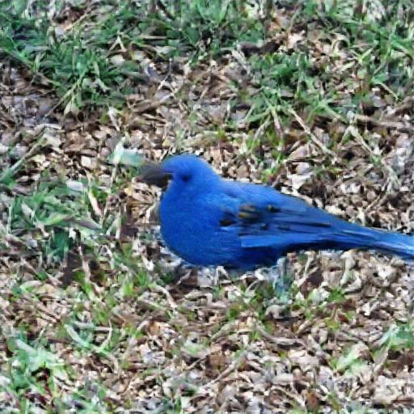](pics/14_鸟_indigo_bunting) [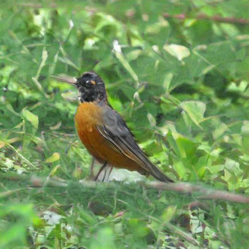](pics/15_鸟_robin) [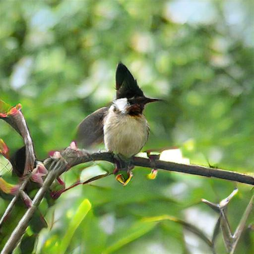](pics/16_鸟_bulbul) [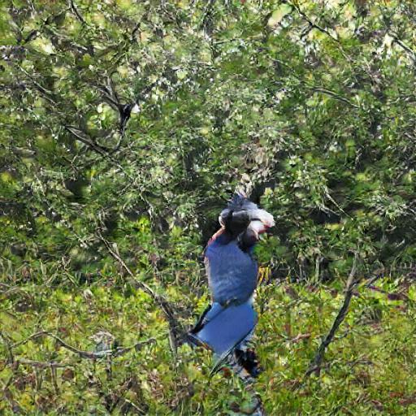](pics/17_鸟_jay) [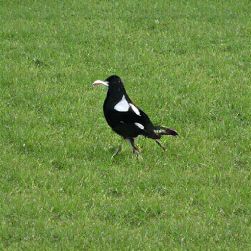](pics/18_鸟_magpie) [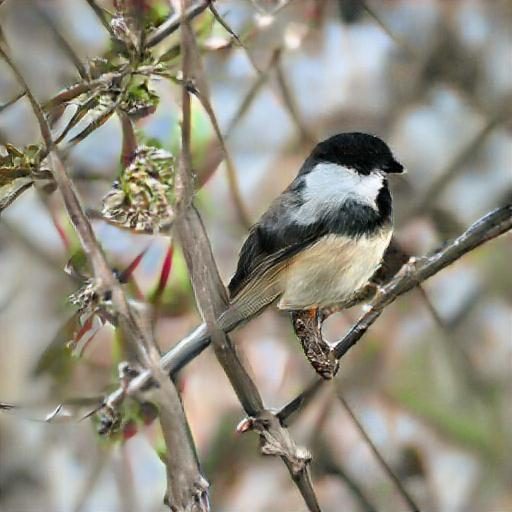](pics/19_鸟_chickadee)

